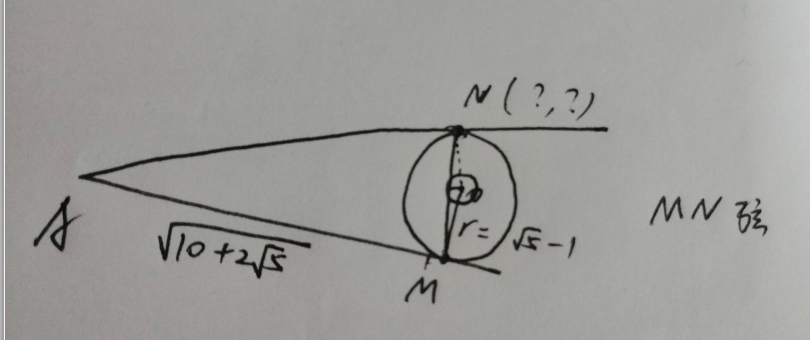

基于圆的几何问题

所有其他点的坐标都是相对A点的，可以看作坐标系移动了(Ax,Ay)

M，O点坐标已给

输入N点，MN形成弦，计算出弦心距，画一个小圆

然后进入概率check，cnt1和cnt2分别是落在小圆和大圆内的次数

符合概率 反推即 对弦心距的长度有要求

再反推N点相对A点的坐标，N有2解

最后的限制是N在圆上，正好是切点的位置

改：输入的值都进行了极坐标运算，另外添加了ollvm

通过check即给出服务器上的flag

> 服务器暂未部署，代码里输出“your flag”之后会替换为服务器的flag