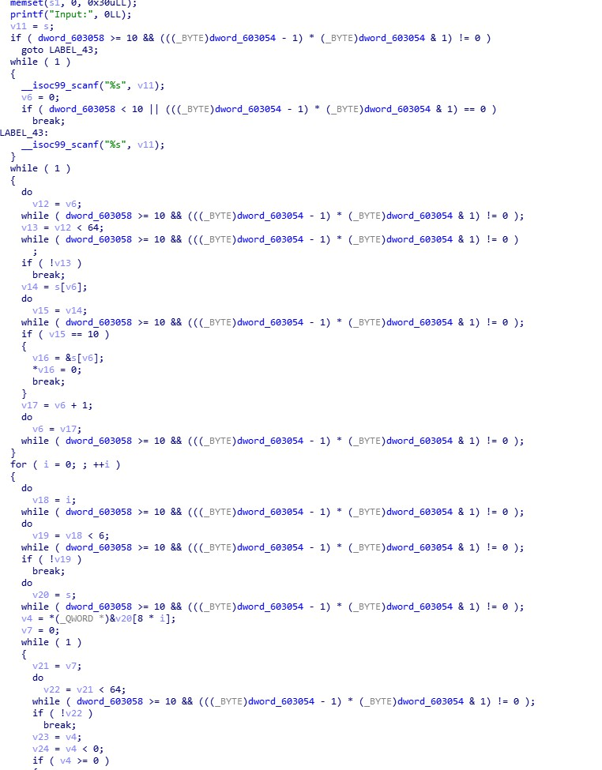
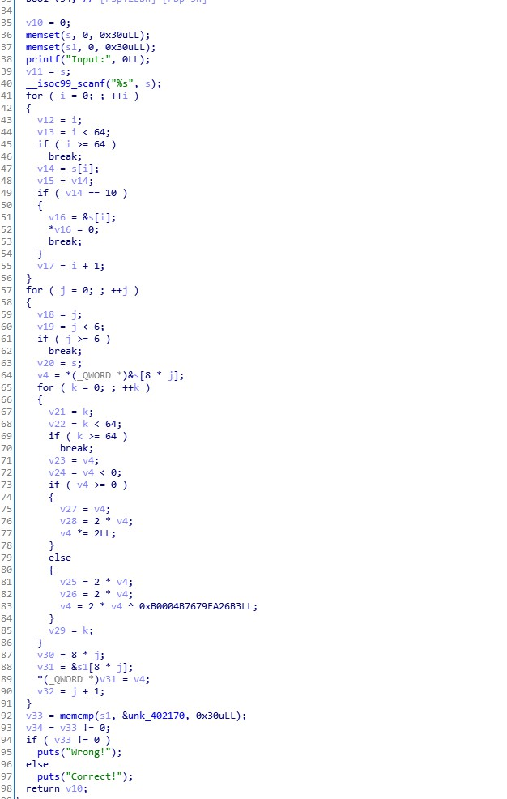

# 永信至诚i春秋 CTF赛题设计说明
### [题目信息]：
出题人|出题时间|题目名字|题目类型|难度等级|题目分值
:-|:-|:-|:-|:-|:-
purecall|20190903|polyre|reverse|5|350

### [题目描述]：
```
抽象代数真让人头秃。
```

### [题目考点]：
```
1. ollvm去除平坦化，去除虚假控制流程，考察选手脚本编写能力
2. CRC64逆向，需要抽象代数知识，或工具，考察选手快速学习知识与寻找工具的能力。
```

### [Flag ]:
`flag{6ff29390-6c20-4c56-ba70-a95758e3d1f8}`

### [题目环境]：
```
ubuntu 16.04 LTS（更新到最新）
```

### [题目制作过程]：
1. 编写 polyre.c 代码，详细代码请从 “源码” 文件夹获取，
2. 使用clang的ollvm插件编译，编译参数在代码第一行，使用strip删除符号表

### [题目writeup]：

ida打开，发现使用了ollvm混淆。大致浏览一下，开了平坦化。同时发现基本块非常多，很难直接调试看出逻辑。

使用“解题”文件夹下的 deflat.py脚本，可以去除平坦化

```
python deflat.py polyre 0x0000000000400620
```

去除之后的伪C代码：



此时发现还开启了虚假控制流程。仔细观察一下，发现这些全局变量对应的跳转都是永真的，因此可以直接写脚本匹配然后修改，详见”解题“文件夹下的script.py

去除虚假控制流程后，代码逻辑就比较清晰了。还是有一些没有用的变量，不太妨碍分析。



观察代码逻辑，首先获取输入，然后把回车用\0替换。

接下来一段代码需要仔细识别。取输入每八个字节作为一个Qword，然后比较他的正负。注意这里其实是取最高位，正的话最高位为0，负最高位为1.

然后先左移1位，如果为负（最高位为1）则异或常量mask，否则继续。

如此循环64次。

我更换了标准CRC64中的特征多项式，使没那么容易发现CRC64，需要选手查询相关资料。

看出这是CRC64后。查阅CRC的资料得知，CRC其实就是有限域上的去模运算。

CRC一般用作校验，效果类似哈希，正常来说是无法求逆的。但是当消息的长度小于mask的长度时，CRC就是可逆的，这是一般容易忽略的地方。

可以搜索到一个工具，[CRC RevEng](https://sourceforge.net/projects/reveng/)，它可以用来计算CRC的逆。需要查看该工具的帮助文档学习使用

试求一下前八个字节：

```
reveng.exe -w 64 -p B0004B7679FA26B3 -v BC8FF26D43536296
```

得到：

```
6666367b67616c66
```

解码出来就是flag第一部分。

如此可以使用工具求出完整flag

如果明白CRC的原理，则可以写脚本求出（该工具也是相同的方法解）

CRC实际上就是有限域GF(2)上的除法，详情查看[wiki](https://en.wikipedia.org/wiki/Cyclic_redundancy_check)

注：接下来的所有计算全是有限域GF(2)上的运算，与平时的四则运算有很大不同，加和减的效果实际都是异或，详情查看[wiki](https://en.wikipedia.org/wiki/GF(2))

我们设消息为T，除数0x1B0004B7679FA26B3（注：CRC中被除数比除数多1bit，且最高位为1）为G，商为k，余数为R，则有：

T = k * G + R 

即 R + T = k * G

设 D = R + T，我们把R, D, T, k, G全部二进制逆序，记为R_re, D_re, T_re, k_re, G_re

则 D_re = R_re + T_re仍然成立， D_re = k_re * G_re亦成立

即 D_re = R_re + T_re = k_re * G_re

即 R_re = T_re + k_re * G_re

T_re 即为 R_re 模 G_re，把T_re再逆序就是要求的T了。

具体脚本如下：

```python
def find_highest_bit(value):
    i = 0
    while value != 0:
        i += 1
        value >>= 1
    return i


def polynomial_divide(numerator, denominator):
    quotient = 0
    tmp = numerator
    bit_count = find_highest_bit(tmp) - find_highest_bit(denominator)
    while bit_count >= 0:
        quotient |= (1 << bit_count)
        tmp ^= (denominator << bit_count)
        bit_count = find_highest_bit(tmp) - find_highest_bit(denominator)
    remainder = tmp
    return quotient, remainder


def reverse(x, bits):
    bin_x = bin(x)[2:].rjust(bits, '0')
    re_bin_x = bin_x[::-1]
    return int(re_bin_x, 2)


cipher = [0x0BC8FF26D43536296, 0x520100780530EE16, 0x4DC0B5EA935F08EC,
          0x342B90AFD853F450, 0x8B250EBCAA2C3681, 0x55759F81A2C68AE4]
res = b""
for a in cipher:
    d = 0xb0004b7679fa26b3  # G(x)
    # q, r = polynomial_divide(a << 64, (1 << 64) + d)
    rr = reverse(a, 64)  # reverse binary
    rd = reverse((1 << 64) + d, 65)
    q, r = polynomial_divide(rr << 64, rd)
    r = reverse(r, 64)
    for i in range(8):
        res += bytes([r & 0xff])
        r >>= 8
print(res.decode())
```

